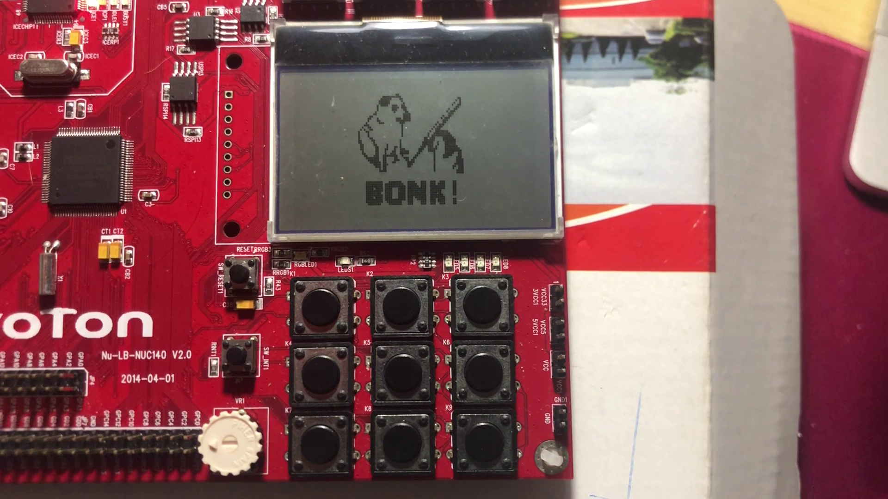
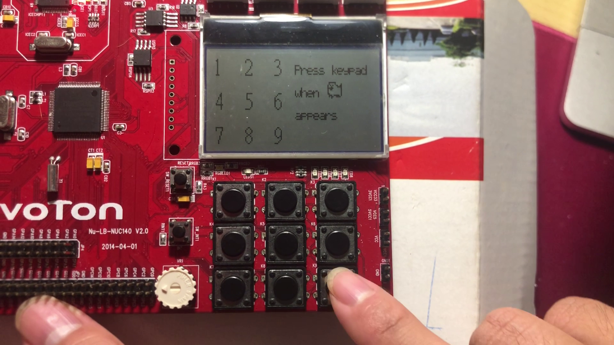
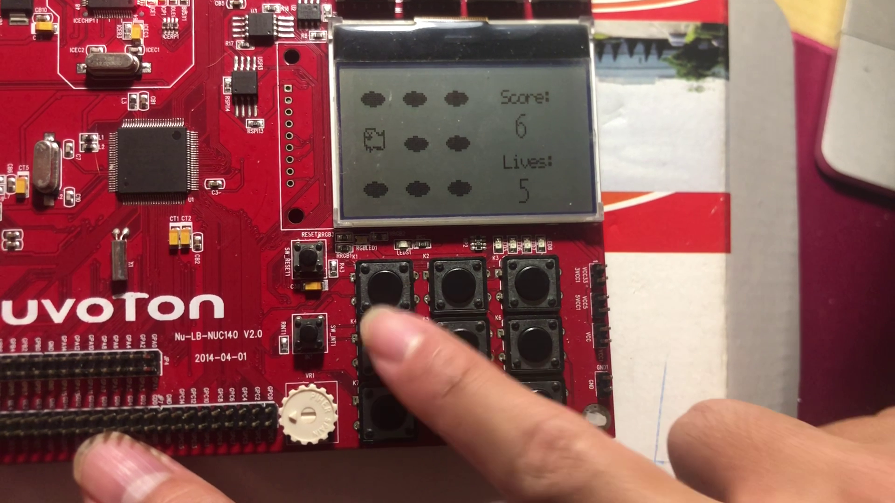
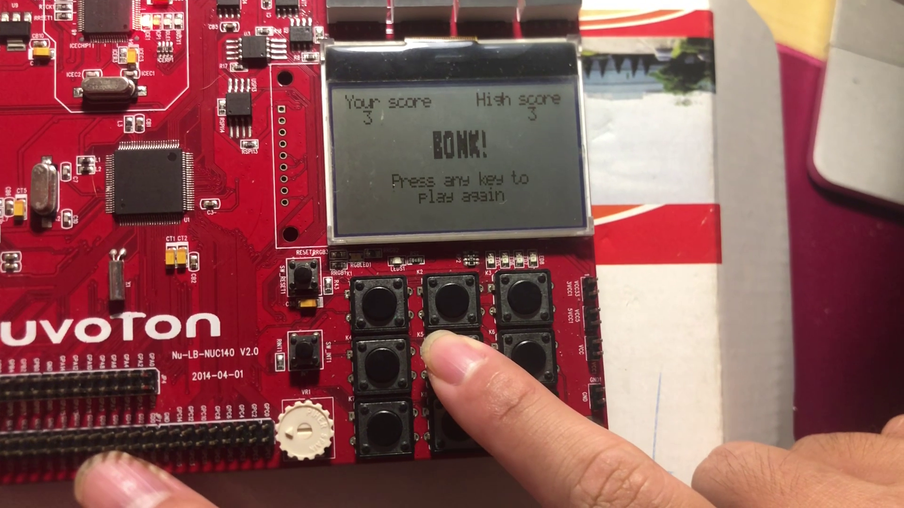
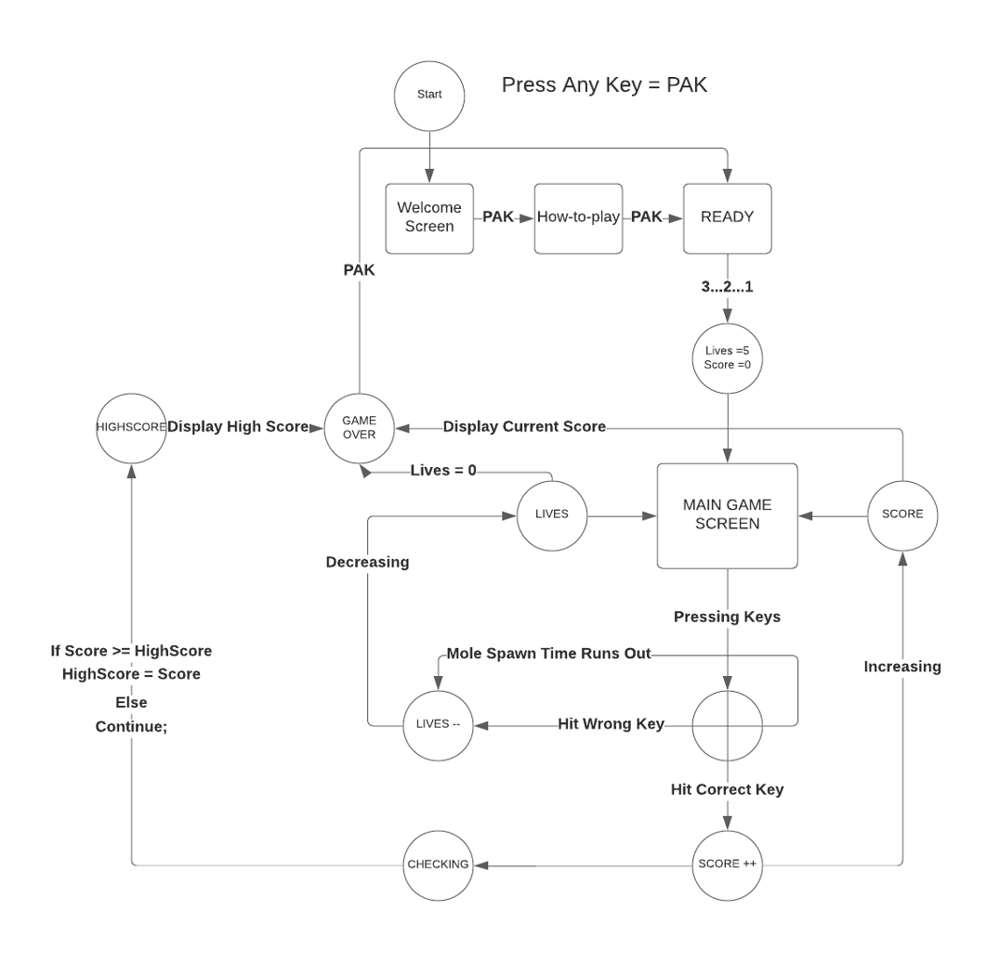
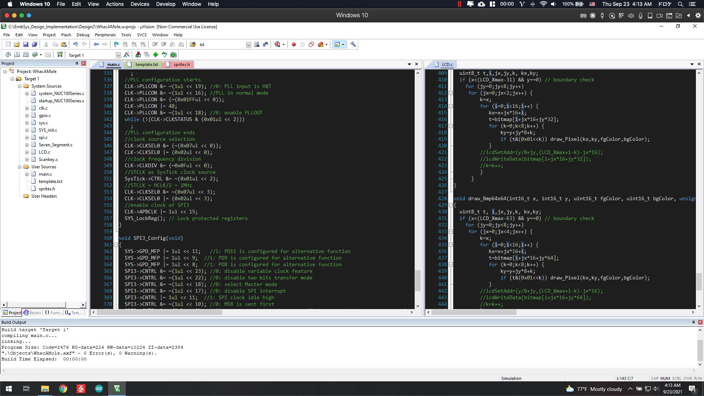

# "BONK!" the game (on Nuvoton Nu-LB-NUC140 board)

### Table of Contents
* [Project Description](#description)
* [How to run project?](#run) 
* [Acknowledgement](#acknowledgement)
* [Connect](#connect)

# Project Description
* My final project for EEET2481 - Embedded System Design and Implementation
* Whac-A-Mole style game with a mix of my favorite meme - BONK!
* Implemented for Nuvoton Nu-LB-NUC140 development board

### How to play
* Try to hit Cheem the dog by pressing the corresponding keys on the keypad
* You get 5 lives, don't get **BONKED!**
* Watch out! The Cheems will appear faster over time 😱

### Game states
Welcome screen:

Tutorial:

Game play:

Gameover:

### Demo video
<figure class="video_container">
    <iframe width="560" height="315" src="https://www.youtube.com/embed/UcwJONlfsrk?controls=0" title="YouTube video player" frameborder="0" allow="accelerometer; autoplay; clipboard-write; encrypted-media; gyroscope; picture-in-picture" allowfullscreen></iframe>
</figure>

### Program flowchart

# How to run project?
- Navigate to `src` folder
- Open the `Bonk.uvprojx` project in Keil uVision 5. It should look something like this:

- Build the project and upload it to your board

#Acknowledgement
Tool for converting between images and byte arrays: https://javl.github.io/image2cpp/. Configure as below to display properly on LCD:
- Background color: Black
- Invert image colors: Yes
- Adjust brightness / alpha threshold to expectation
- Scaling: scale or stretch to fill canvas
- Center everything
- Code output format: plain bytes
- Draw mode: Vertical - 1 bit per pixel (since this LCD uses vertical scan)
- Generate code and benefit!

Also I'd like to send my thanks to my teammates Thuận, Trung, Triều for helping with this project. Fun story, this project was done during the heat of Corona pandemic in Ho Chi Minh city, where I didn't get to touch the board until the very last days. I paired up with 2 other guys who had the board, where I wrote the program and send it over to them to check pixel by pixel. Jeez it was a pain 😂. After nights of pair-programming in irritation, they finally managed to get the board deliver to me to fully work on the game. Finaly the product got shipped just an hour before the deadline =)) 

# Connect with me
* My [Website](https://hoangdesu.com/)
* MY [LinkedIn](https://www.linkedin.com/in/hoangdesu/)
* My [Facebook](https://www.facebook.com/Hoangdayo/)
* My [Instagram](https://www.instagram.com/hoang.desu/)
* You can shoot me an [email](mailto:hoangdesu@gmail.com) too

If you find this project useful, you can let me know. I would love to hear about it!

